# Architecture Diagrams

## Last Updated
- Date: 2026-03-19
- Updated by: architect + backend-engineer

This file is the canonical diagram set for the system. Update diagrams whenever architecture, data flow, or critical business flow changes.

## Diagram 1: System Context (C4-L1)

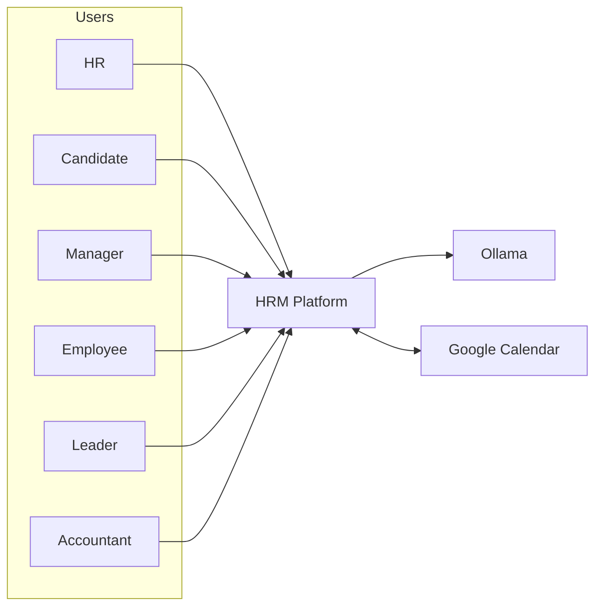

## Diagram 2: Container View (C4-L2)

```mermaid
flowchart TB
  UI[React.js + TypeScript UI / Role Workspaces]
  API[API Gateway]

  subgraph Core[Core Services]
    COREPKG[Core Shared Package]
    AUTH[Auth and Access Service]
    ADMIN[Admin Governance Service]
    POLICY[Access Policy Evaluator]
    REC[Recruitment Services]
    SCOREDOM[Match Scoring Service]
    EMPDOM[Employee Services]
    NOTIFY[Notification Service]
    AUTOENG[Automation Rule Engine]
    HROPS[HR Automation Services]
    WORKERS[Background Workers]
    ANALYTICS[Reporting and KPI Services]
    AUDIT[Audit Service]
  end

  subgraph Infra[Infrastructure]
    DB[(PostgreSQL)]
    OBJ[(Object Storage)]
    QUEUE[(Queue/Event Bus)]
    REDISDNL[(Redis Denylist: jti/sid)]
  end

  subgraph Ext[External Integrations]
    OLLAMA[Ollama Adapter]
    GCALSYNC[Google Calendar Adapter]
    SENTRY[Sentry]
  end

  UI --> API
  API --> AUTH
  API --> ADMIN
  API --> POLICY
  API --> REC
  API --> SCOREDOM
  API --> EMPDOM
  API --> NOTIFY
  API --> AUTOENG
  API --> HROPS
  API --> ANALYTICS
  WORKERS --> POLICY
  AUTH --> REDISDNL
  ADMIN --> DB
  AUTH -.imports.-> COREPKG
  ADMIN -.imports.-> COREPKG
  POLICY -.imports.-> COREPKG
  REC -.imports.-> COREPKG
  SCOREDOM -.imports.-> COREPKG
  EMPDOM -.imports.-> COREPKG
  NOTIFY -.imports.-> COREPKG
  HROPS -.imports.-> COREPKG
  ANALYTICS -.imports.-> COREPKG

  REC --> DB
  SCOREDOM --> DB
  EMPDOM --> DB
  NOTIFY --> DB
  AUTOENG --> DB
  HROPS --> DB
  ANALYTICS --> DB
  AUDIT --> DB

  REC --> OBJ
  REC --> QUEUE
  SCOREDOM --> QUEUE
  HROPS --> QUEUE
  ANALYTICS --> QUEUE

  REC --> AUTOENG
  EMPDOM --> AUTOENG
  AUTOENG -.notification.emit.-> NOTIFY

  REC --> OLLAMA
  SCOREDOM --> OLLAMA
  REC <--> GCALSYNC
  API --> AUDIT
  POLICY --> AUDIT
  WORKERS --> AUDIT
  WORKERS --> SCOREDOM
  UI --> SENTRY
```

## Diagram 3: Domain Interaction

```mermaid
flowchart LR
  VAC[Vacancy Management]
  CAND[Candidate Management]
  SCORE[AI Match Scoring]
  INT[Interview Management]
  FAIR[Interview Feedback Fairness Gate]
  OFFER[Offer Lifecycle]
  HIRE[Hiring Decision]
  EMP[Employee Profile]
  ONB[Onboarding]
  AUTO[HR Automation]
  NOTIFY[Notification Service]
  KPI[KPI and Audit]

  VAC --> SCORE
  CAND --> SCORE
  SCORE --> INT
  INT --> FAIR
  FAIR --> OFFER
  OFFER --> HIRE
  HIRE --> EMP
  EMP --> ONB
  VAC --> AUTO
  INT --> AUTO
  OFFER --> AUTO
  ONB --> AUTO
  AUTO -.notification.emit.-> NOTIFY

  VAC --> KPI
  CAND --> KPI
  SCORE --> KPI
  INT --> KPI
  HIRE --> KPI
  EMP --> KPI
  ONB --> KPI
  AUTO --> KPI
```

## Diagram 4: Candidate Screening and Shortlist Review Sequence

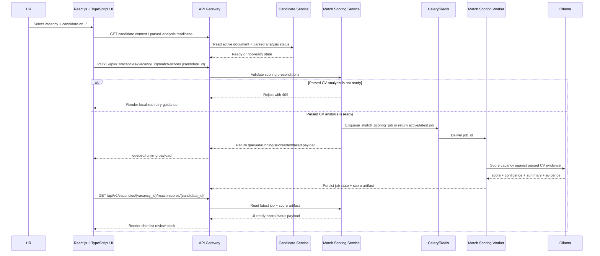

Current implementation persists lifecycle state in `match_scoring_jobs` and UI-ready explainable
artifacts in `match_score_artifacts`. The parsed CV payload now remains profession-agnostic and
includes workplace history with held positions, education entries, normalized titles/dates, and
generic skills before scoring.

## Diagram 5: Interview Scheduling Sequence

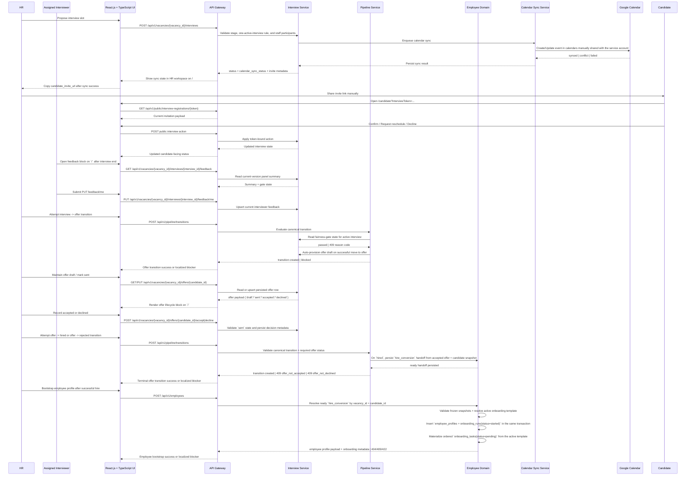

The interview flow is now implemented from `docs/project/interview-planning-pass.md` and `docs/project/interview-feedback-fairness-pass.md`, and the downstream offer flow now stays on the same vacancy route tree without adding candidate auth or a new top-level route tree. In the current free-mode runtime, Google Calendar access is service-account based, each interviewer calendar is shared manually with that service account, candidate delivery still uses `candidate_invite_url` instead of Google guest invitations, the fairness guard stays on the existing `interview -> offer` transition, offer acceptance/decline remains staff-recorded in `/`, successful `offer -> hired` persists one durable `hire_conversion` handoff, the follow-on staff employee bootstrap runs on `POST /api/v1/employees` where `employee_profiles`, `onboarding_runs`, and materialized `onboarding_tasks` commit atomically against the current active template, the employee self-service portal stays on `/employee` plus `/api/v1/employees/me/onboarding*`, and HR/admin plus managers now observe onboarding progress on the existing `/` route through `GET /api/v1/onboarding/runs*`.

## Diagram 6: Onboarding Template Management Sequence

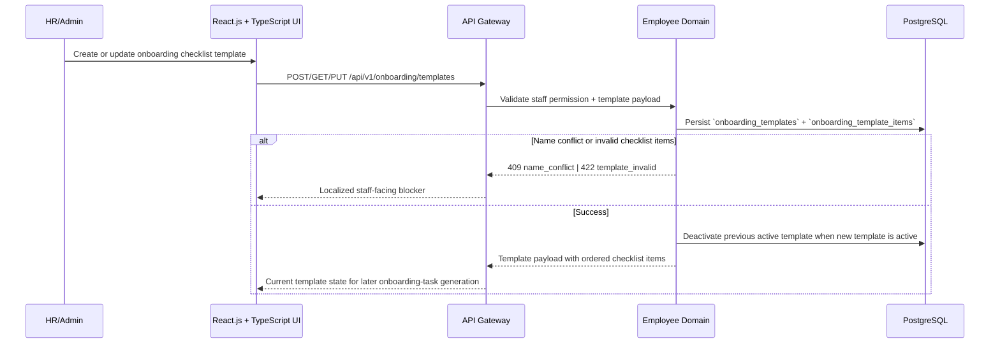

## Diagram 7: Onboarding Task Materialization and Backfill Sequence

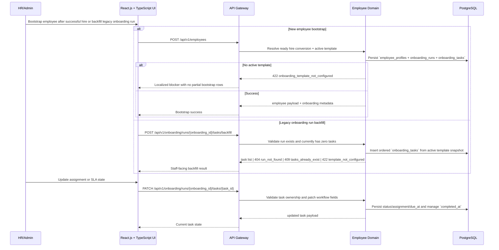

## Diagram 8: Employee Self-Service Onboarding Portal Sequence

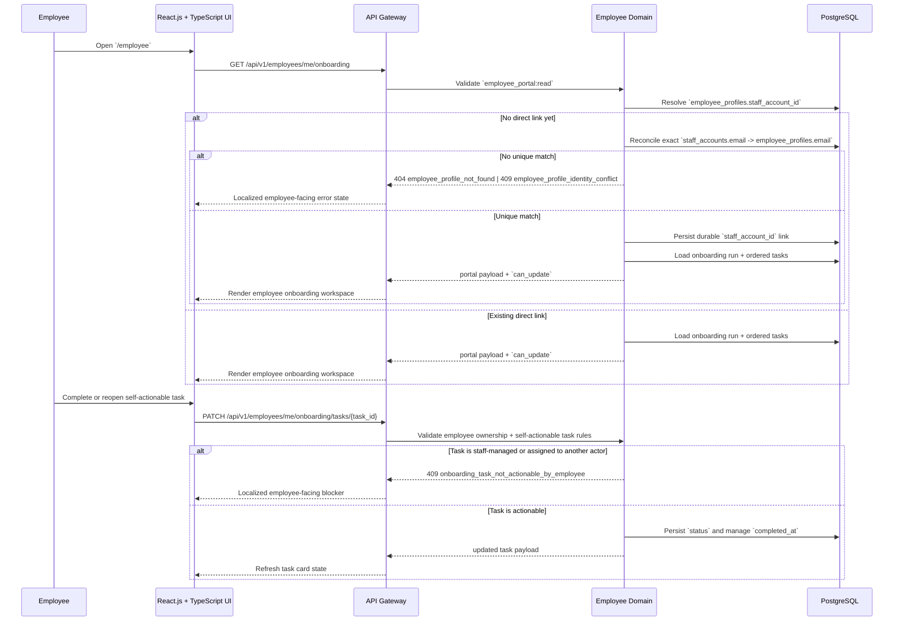

## Diagram 9: Onboarding Progress Dashboard Sequence

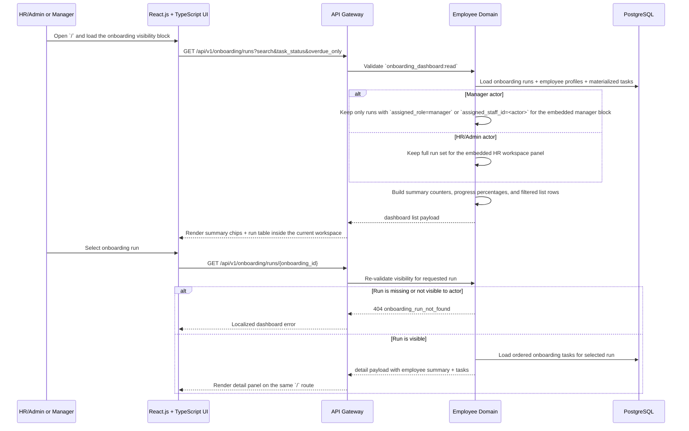

## Diagram 9A: Manager Workspace Sequence

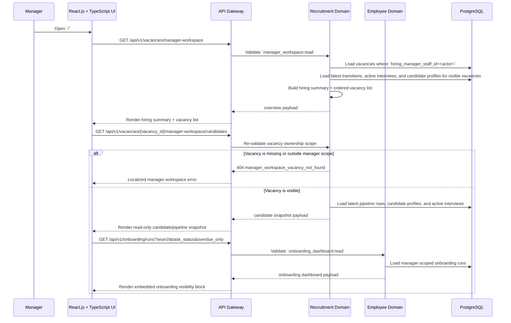

## Diagram 9B: Accountant Workspace Sequence

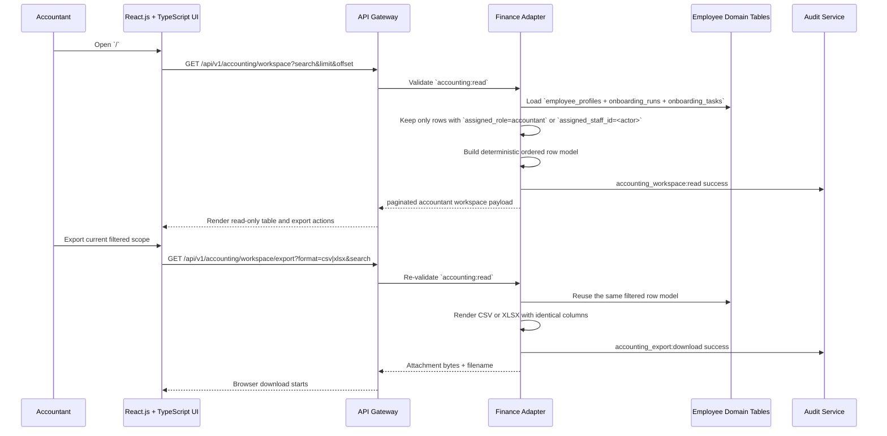

## Diagram 9C: Role-Specific Notification Sequence

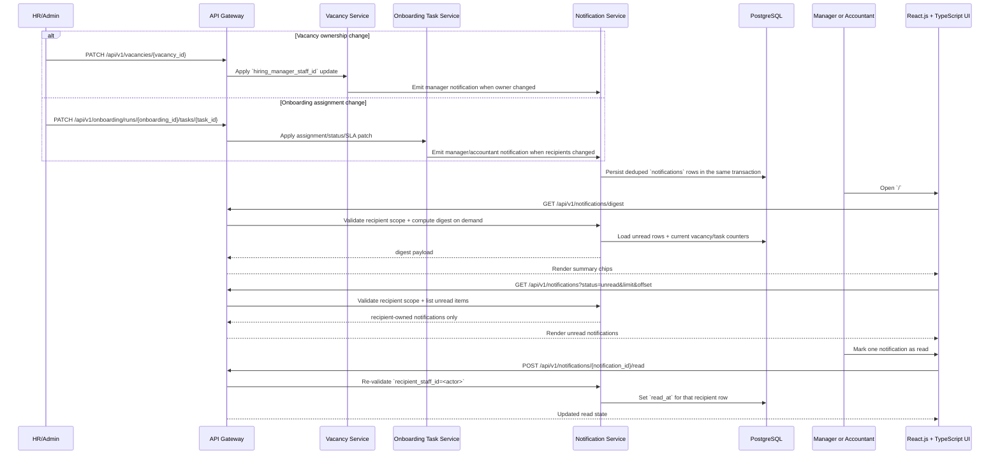

## Diagram 10: Deployment and Trust Boundaries

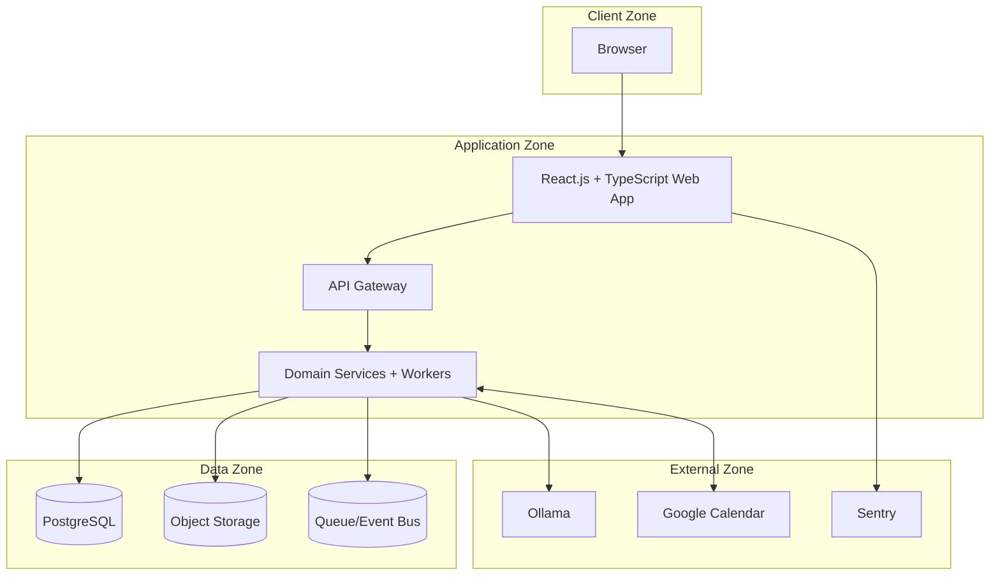

## Diagram 11: Public Vacancy Application Sequence (v1)

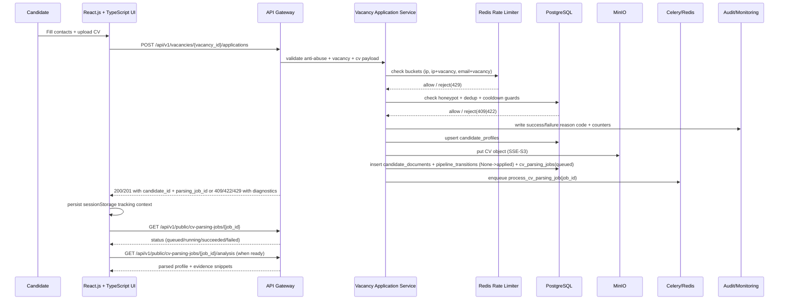

## Diagram 12: Delivery Pipeline (GitHub + CI)

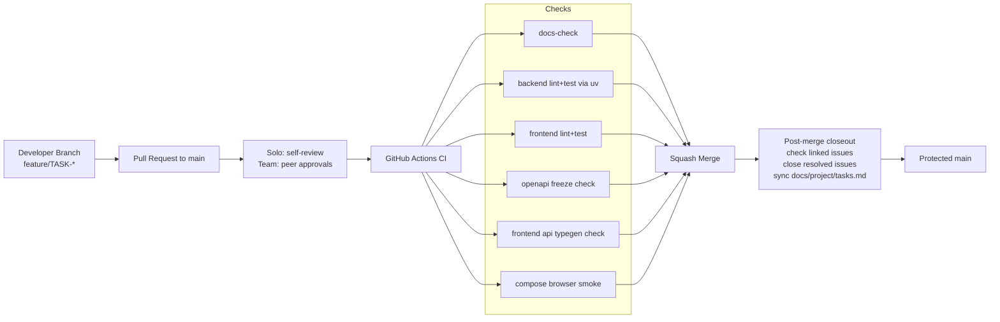

## Diagram 13: Docker Compose Runtime Topology (Phase 1)

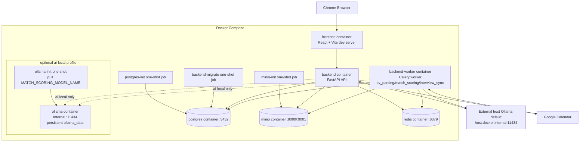

Default compose startup keeps the external-host Ollama path, while the optional `ai-local`
profile switches `backend` and `backend-worker` to compose-local Ollama without publishing the
Ollama port on the host.

## Diagram 14: Authentication and Session Lifecycle Sequence

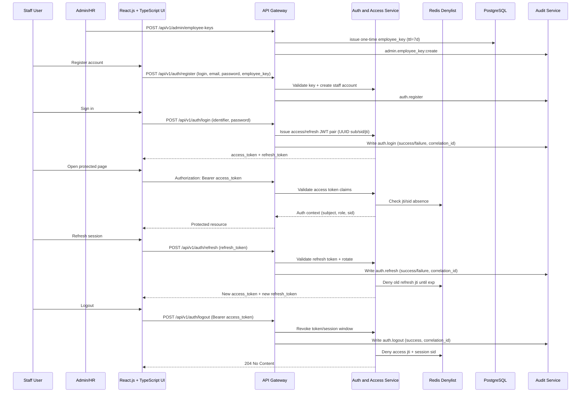

## Diagram 15: Unified Access Enforcement and Audit Flow

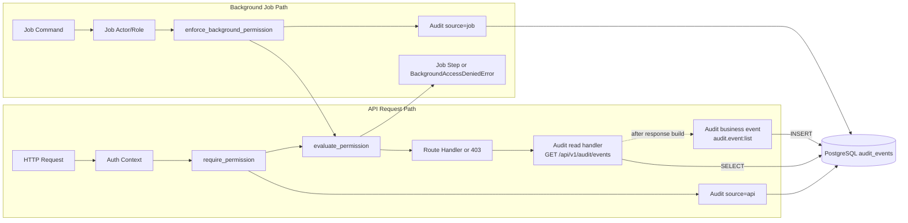

## Diagram 15B: Audit + KPI Export Attachment Flow

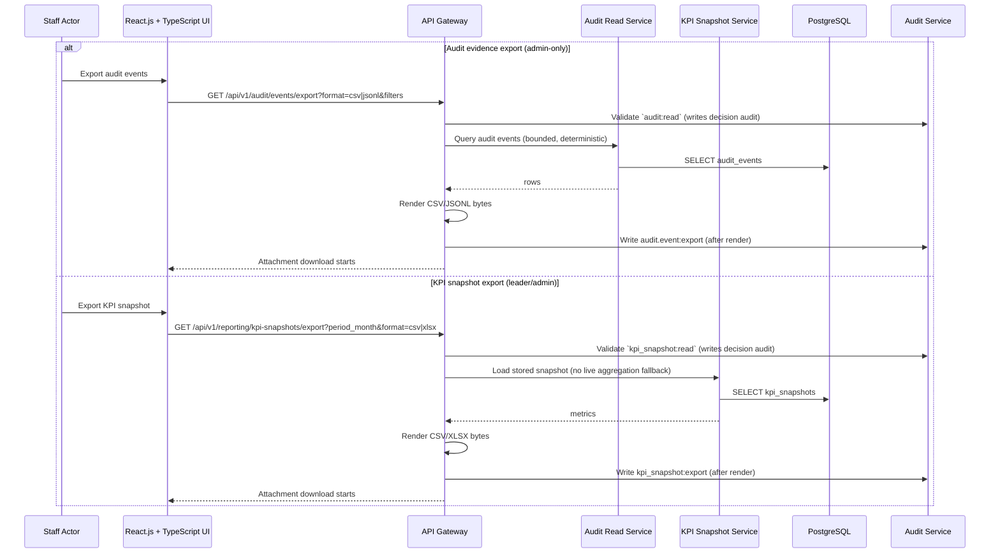

## Diagram 16: Candidate Profile and CV Upload Sequence

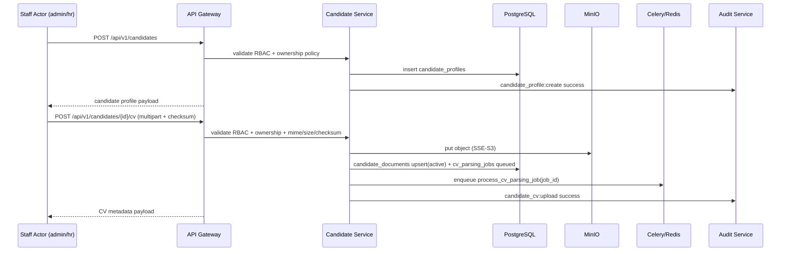

## Diagram 17: Pipeline Transition Validator Flow

```mermaid
flowchart LR
  REQ[POST /api/v1/pipeline/transitions] --> RBAC[require_permission pipeline:transition]
  RBAC --> LOAD[Load vacancy + candidate + latest transition]
  LOAD --> CURR[Resolve from_stage from append-only history]
  CURR --> VAL{Canonical transition allowed?}
  VAL -->|No| ERR[422 Unprocessable Entity]
  VAL -->|Yes| TARGET{Target stage}
  TARGET -->|offer| FAIR{Fairness gate passed?}
  FAIR -->|No| ERR409A[409 Fairness reason code]
  FAIR -->|Yes| OFFERBUNDLE[Atomically insert pipeline_transitions row + ensure offer draft]
  TARGET -->|hired/rejected| OFFERCHK{Offer status compatible?}
  OFFERCHK -->|No| ERR409B[409 offer_not_accepted / offer_not_declined]
  OFFERCHK -->|Yes| RESOLVE{Target is hired?}
  RESOLVE -->|Yes| HIREBUNDLE[Atomically insert hired transition + hire_conversion handoff]
  RESOLVE -->|No, rejected| APPEND[Insert pipeline_transitions row]
  TARGET -->|other| APPEND
  OFFERBUNDLE --> AUD[Audit pipeline:transition success]
  HIREBUNDLE --> AUD
  APPEND --> AUD[Audit pipeline:transition success]
  AUD --> RES[200 Transition response]
```

## Diagram 18: Async CV Parsing Worker Lifecycle

```mermaid
flowchart LR
  Q[queued job] --> R[running claim]
  R --> L[load candidate document from object storage]
  L --> T{mime type}
  T -->|application/pdf| PDF[extract native PDF text]
  T -->|application/vnd.openxmlformats-officedocument.wordprocessingml.document| DOCX[extract native DOCX text]
  PDF --> N[RU/EN normalization + profession-agnostic profile enrichment + evidence mapping]
  DOCX --> N
  N --> P[persist parsed_profile_json + evidence_json + detected_language + parsed_at]
  P --> S[succeeded]
  L --> F[failed]
  PDF -->|broken or empty text| F
  DOCX -->|broken or empty text| F
  F --> RET{attempt_count < max_attempts}
  RET -->|yes| R
  RET -->|no| TF[terminal failed]
```

Current implementation keeps evidence offsets anchored to the extracted text used for normalization,
persists profession-agnostic workplaces with held positions plus education/title/date/skills
artifacts inside `parsed_profile_json`, and populates PDF `page` numbers when the extractor can
resolve the matched range.

## Diagram 19: Admin Route Guard and Redirect Flow (ADMIN-01)

```mermaid
flowchart LR
  USER[User opens /admin] --> GUARD[Frontend AdminGuard]
  GUARD --> TOKEN{Access token present?}
  TOKEN -->|No| R401[Redirect /access-denied?reason=unauthorized]
  TOKEN -->|Yes| ROLE{Role == admin?}
  ROLE -->|No| R403[Redirect /access-denied?reason=forbidden]
  ROLE -->|Yes| ADMIN[Render Admin Shell with staff, key, candidate, vacancy, pipeline, and audit consoles]

  GUARD --> TAGS[Sentry tags: workspace=admin, role, route]
  TAGS --> SENTRY[Sentry]
```

## Diagram 20: Admin Staff Management Flow (ADMIN-02)

```mermaid
sequenceDiagram
  participant ADM as Admin User
  participant UI as React Admin Staff Screen (/admin/staff)
  participant API as Admin Router
  participant SRV as Admin Service
  participant DAO as AdminStaffAccountDAO
  participant AUD as Audit Service

  ADM->>UI: Open /admin/staff
  UI->>API: GET /api/v1/admin/staff?limit&offset&search&role&is_active
  API->>SRV: list_staff_accounts(...)
  SRV->>DAO: list_accounts + count_accounts
  DAO-->>SRV: items + total
  SRV-->>API: AdminStaffListResponse
  API->>AUD: admin.staff:list success/failure
  API-->>UI: 200 list payload or 422

  ADM->>UI: Update row role/is_active
  UI->>API: PATCH /api/v1/admin/staff/{staff_id}
  API->>SRV: update_staff_account(...)
  SRV->>DAO: get_by_id + count_active_admins + update_account_fields
  SRV-->>API: StaffResponse or 404/409/422
  API->>AUD: admin.staff:update success/failure + reason_code
  API-->>UI: updated row or localized error message

  Note over SRV: Strict guard:\n- self-demotion/self-disable forbidden\n- last-active-admin demotion/disable forbidden
```

## Diagram 21: Employee Key Lifecycle Management Flow (ADMIN-03)

```mermaid
sequenceDiagram
  participant ADM as Admin/HR User
  participant UI as React Admin Employee Keys Screen (/admin/employee-keys)
  participant API as Admin Router
  participant SRV as Admin Service
  participant DAO as AdminEmployeeRegistrationKeyDAO
  participant AUTH as Auth Service (register path)
  participant AUD as Audit Service

  ADM->>UI: Open /admin/employee-keys
  UI->>API: GET /api/v1/admin/employee-keys?limit&offset&filters
  API->>SRV: list_employee_keys(...)
  SRV->>DAO: list_keys + count_keys
  DAO-->>SRV: key rows + total
  SRV-->>API: AdminEmployeeKeyListResponse (status=active|used|expired|revoked)
  API->>AUD: admin.employee_key:list success/failure
  API-->>UI: paginated list payload

  ADM->>UI: Create key
  UI->>API: POST /api/v1/admin/employee-keys
  API->>SRV: create_employee_key(...)
  SRV->>DAO: create_key(...)
  API->>AUD: admin.employee_key:create success/failure
  API-->>UI: EmployeeRegistrationKeyResponse

  ADM->>UI: Revoke active key
  UI->>API: POST /api/v1/admin/employee-keys/{key_id}/revoke
  API->>SRV: revoke_employee_key(...)
  SRV->>DAO: get_by_id + revoke_key
  SRV-->>API: 200 or 404/409 reason-code
  API->>AUD: admin.employee_key:revoke success/failure + reason
  API-->>UI: revoked row or localized error

  Note over AUTH: Register path consumes only keys where\nused_at=null, revoked_at=null, expires_at>now
```

## Diagram 22: Frontend Observability Flow (TASK-11-10)

```mermaid
flowchart LR
  USER[User opens critical route] --> ROUTE[Observed route: /, /employee, /candidate, /login, /admin, /admin/staff, /admin/employee-keys, /admin/candidates, /admin/vacancies, /admin/pipeline, /admin/audit]
  ROUTE --> TAGS[Sentry tags: workspace=hr|manager|accountant|employee|candidate|auth|admin, role, route]
  TAGS --> SENTRY[Sentry]

  ROUTE --> UI[React page and query or mutation logic]
  UI --> HTTP[Shared apiRequest wrapper]
  HTTP -->|Network error or non-2xx| CAPTURE[Capture exception with method/status/path]
  CAPTURE --> SENTRY

  UI -->|Render throws| BOUNDARY[Top-level AppErrorBoundary]
  BOUNDARY --> FALLBACK[Localized fallback UI]
  BOUNDARY --> SENTRY

  CONFIG[VITE_SENTRY_* env config] --> SENTRY
```

## Diagram 23: KPI Snapshot Aggregation Flow (TASK-10-01)

```mermaid
flowchart LR
  subgraph Domains[Transactional Domains]
    VAC[Vacancies]
    PIPE[Pipeline Transitions]
    INT[Interviews]
    OFFER[Offers]
    HIRE[Hire Conversions]
    ONB[Onboarding Runs/Tasks]
    AUTO_METRIC[(automation_metric_events)]
  end

  subgraph Reporting[Reporting]
    REBUILD[Admin Rebuild Request]
    AGG[KPI Aggregation Service]
    SNAP[(kpi_snapshots)]
  READ[Snapshot Read API (leader/admin)]
  end

  REBUILD --> AGG
  VAC --> AGG
  PIPE --> AGG
  INT --> AGG
  OFFER --> AGG
  HIRE --> AGG
  ONB --> AGG
  AUTO_METRIC --> AGG
  AGG --> SNAP
  READ --> SNAP
```

## Diagram 24: Automation Execution Logging and KPI Event Flow (TASK-08-04)

```mermaid
sequenceDiagram
  participant DOM as Domain Service
  participant EXEC as AutomationActionExecutor
  participant RUN as automation_execution_runs
  participant ACT as automation_action_executions
  participant MET as automation_metric_events
  participant NOTIF as notifications
  participant RPT as KPI Snapshot Service
  participant OPS as Ops API (admin/hr)

  DOM->>EXEC: handle_event(event, correlation_id)
  EXEC->>RUN: INSERT run(status=running, trace_id)
  EXEC->>EXEC: evaluate rules -> plan[]
  EXEC->>NOTIF: INSERT notification rows (dedupe-safe)
  EXEC->>ACT: INSERT action rows (succeeded/deduped/failed)
  EXEC->>MET: INSERT metric row(outcome, counts)
  EXEC->>RUN: UPDATE run(status, counts, error)
  OPS->>RUN: list/view runs (filters)
  OPS->>ACT: list/view actions
  RPT->>MET: aggregate counts for monthly KPI rebuild
```

Automation execution logs remain the operator-facing troubleshooting source of truth, while
`automation_metric_events` is the durable KPI event stream used by reporting to compute
`total_hr_operations_count`, `automated_hr_operations_count`, and the derived share metric.

## Diagram 25: Admin Control Plane Slice (ADMIN-04)

```mermaid
flowchart LR
  USER[Admin opens /admin] --> SHELL[Admin Shell]
  SHELL --> CANDS[/admin/candidates]
  SHELL --> VACS[/admin/vacancies]
  SHELL --> PIPE[/admin/pipeline]
  SHELL --> AUD[/admin/audit]

  CANDS --> CAPI[GET/POST/PUT /api/v1/candidates*]
  VACS --> VAPI[GET/POST/PUT /api/v1/vacancies*]
  PIPE --> PAPI[GET /api/v1/vacancies + GET/POST /api/v1/pipeline/transitions]
  AUD --> AAPI[GET /api/v1/audit/events + export csv/jsonl/xlsx]

  CANDS --> TAGS[Sentry route tags: route=/admin/candidates]
  VACS --> TAGS
  PIPE --> TAGS
  AUD --> TAGS
```

The ADMIN-04 slice stays frontend-first over the existing backend contracts. It keeps the control
plane non-destructive, avoids a new admin backend namespace, and uses the audit export endpoint for
read-only evidence downloads in CSV, JSONL, and XLSX formats.
