# Architecture Diagrams

## Last Updated
- Date: 2026-03-09
- Updated by: architect + backend-engineer + frontend-engineer

This file is the canonical diagram set for the system. Update diagrams whenever architecture, data flow, or critical business flow changes.

## Diagram 1: System Context (C4-L1)

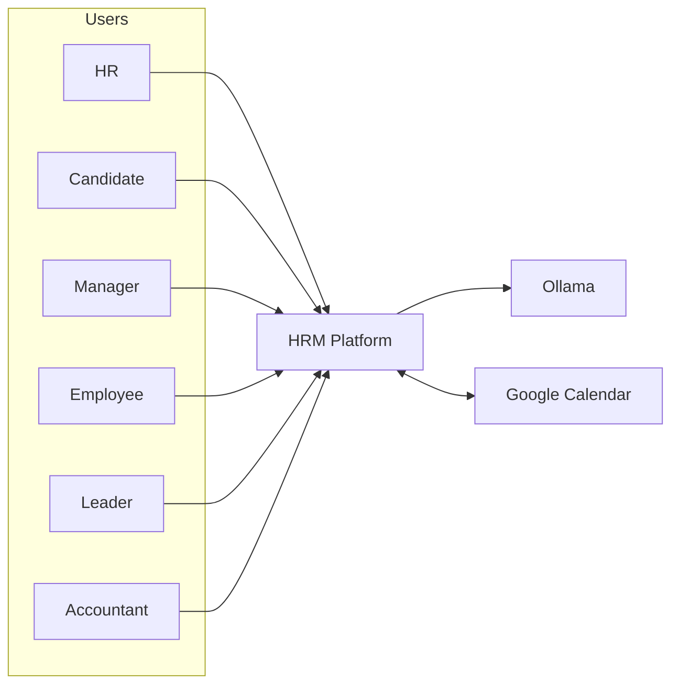

## Diagram 2: Container View (C4-L2)

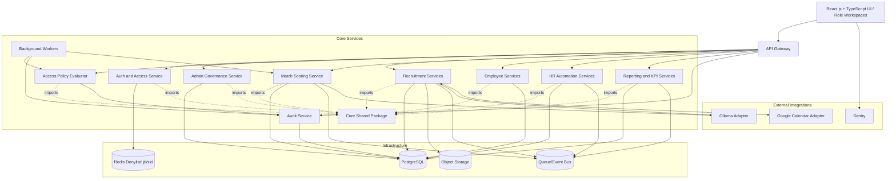

## Diagram 3: Domain Interaction

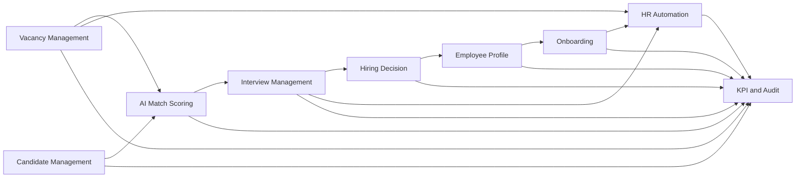

## Diagram 4: Candidate Screening and Shortlist Review Sequence

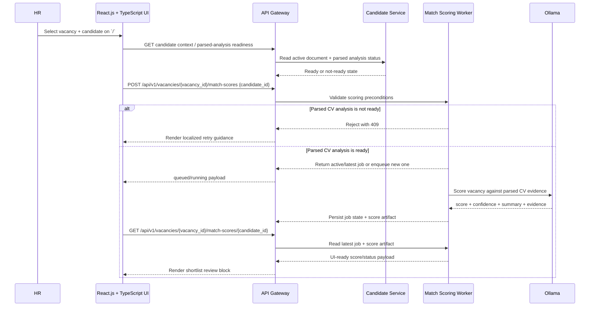

## Diagram 5: Interview Scheduling Sequence

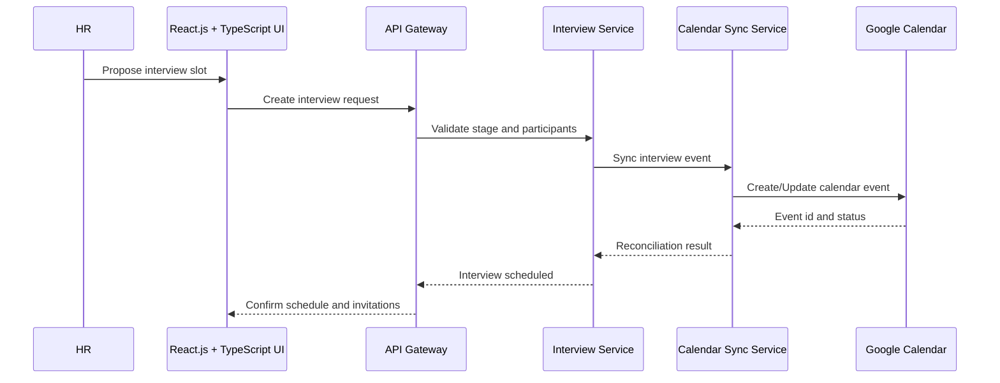

Interview scheduling implementation remains deferred until a dedicated planning pass closes interview entity, registration, reschedule/cancel, and calendar sync conflict rules.

## Diagram 6: Deployment and Trust Boundaries

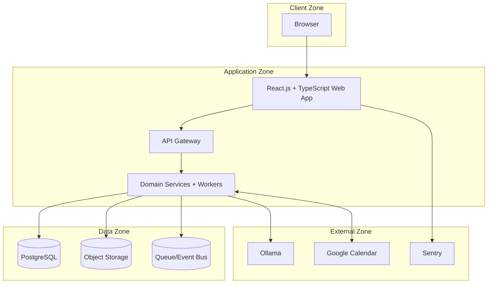

## Diagram 7: Public Vacancy Application Sequence (v1)

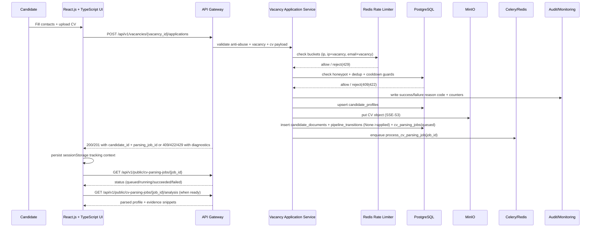

## Diagram 8: Delivery Pipeline (GitHub + CI)

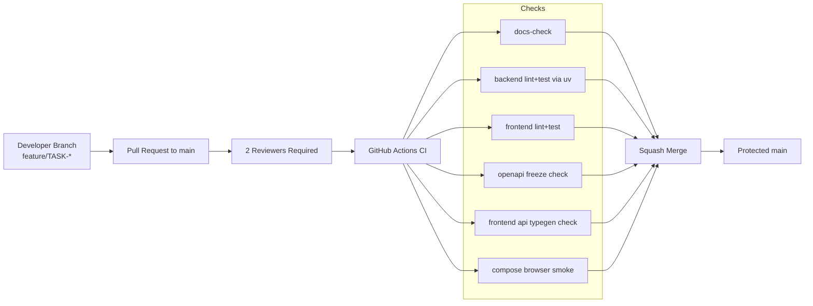

## Diagram 9: Docker Compose Runtime Topology (Phase 1)

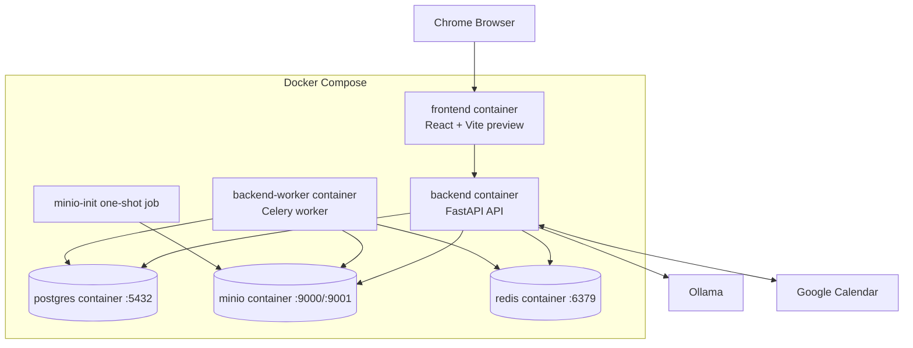

## Diagram 10: Authentication and Session Lifecycle Sequence

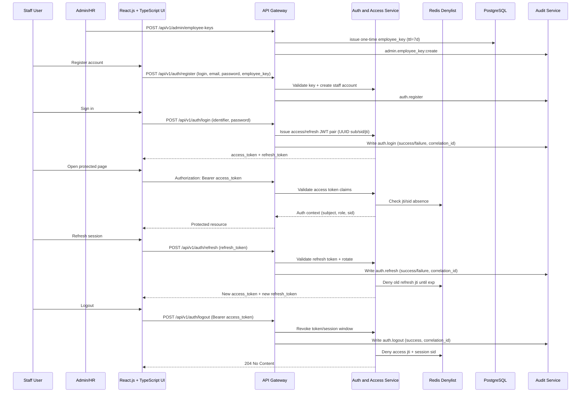

## Diagram 11: Unified Access Enforcement and Audit Flow

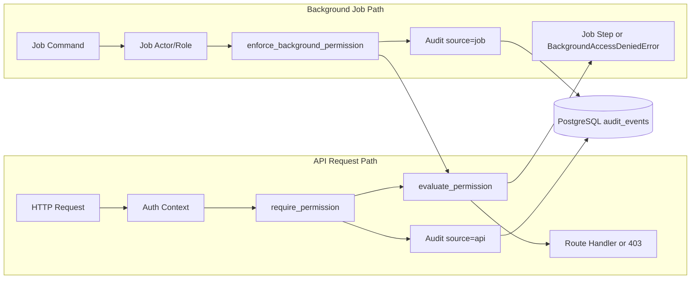

## Diagram 12: Candidate Profile and CV Upload Sequence

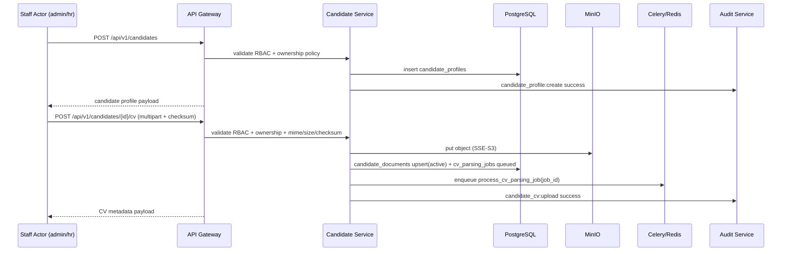

## Diagram 13: Pipeline Transition Validator Flow

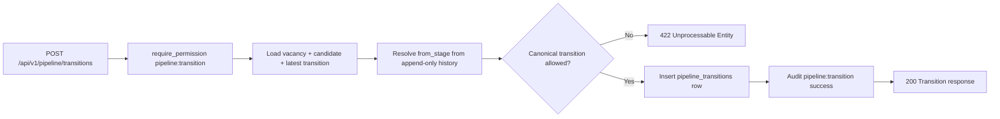

## Diagram 14: Async CV Parsing Worker Lifecycle

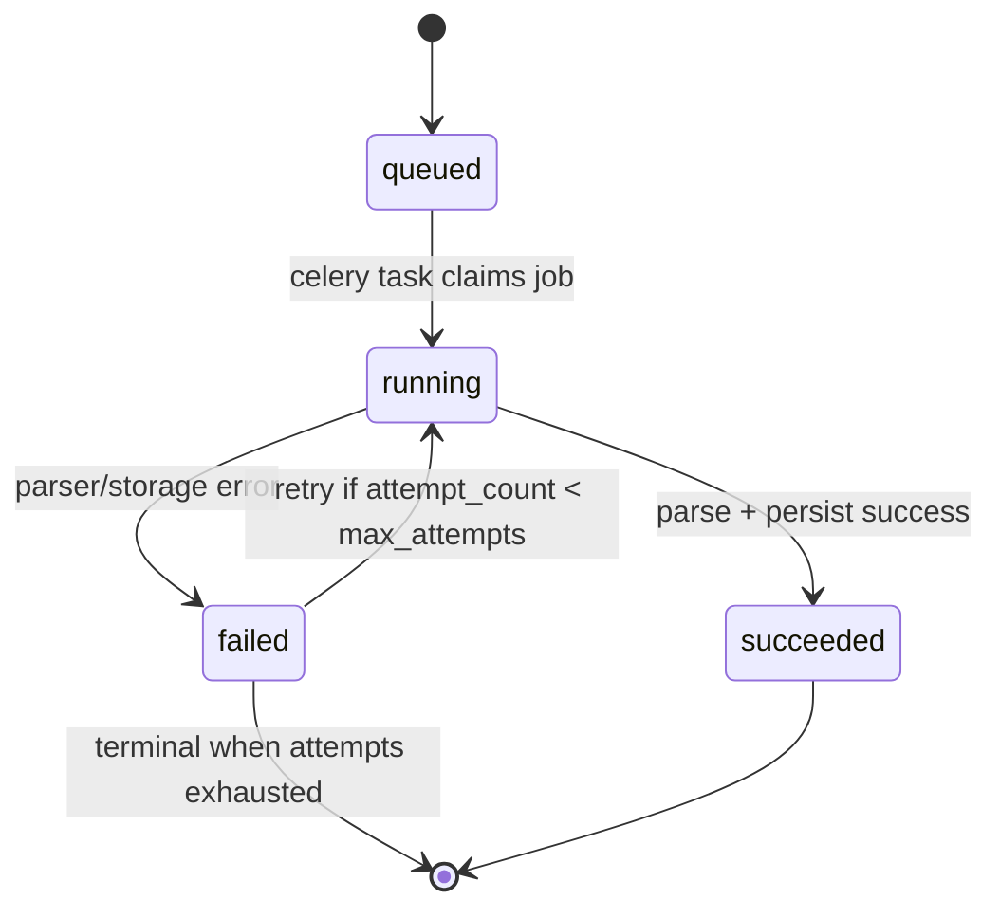

## Diagram 15: Admin Route Guard and Redirect Flow (ADMIN-01)

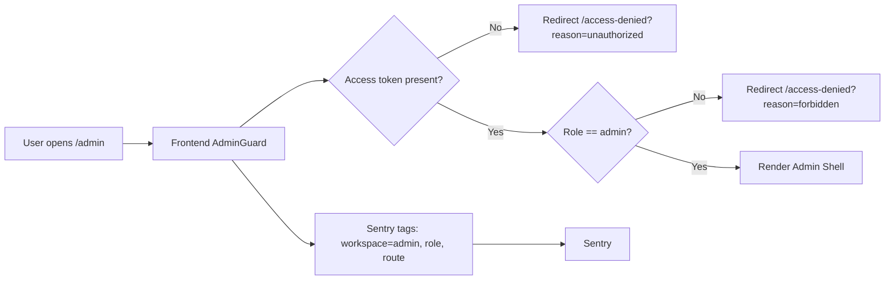

## Diagram 16: Admin Staff Management Flow (ADMIN-02)

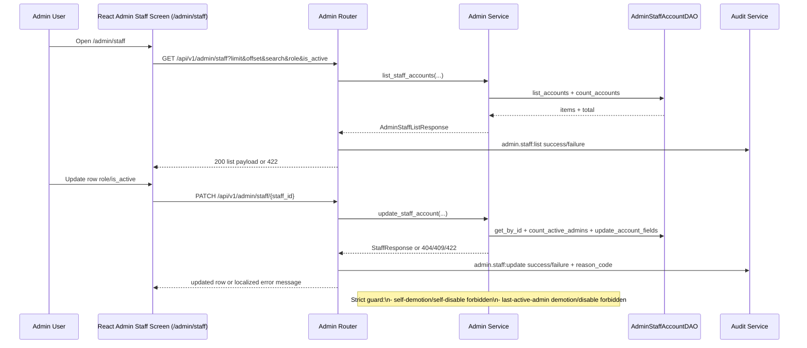

## Diagram 17: Employee Key Lifecycle Management Flow (ADMIN-03)

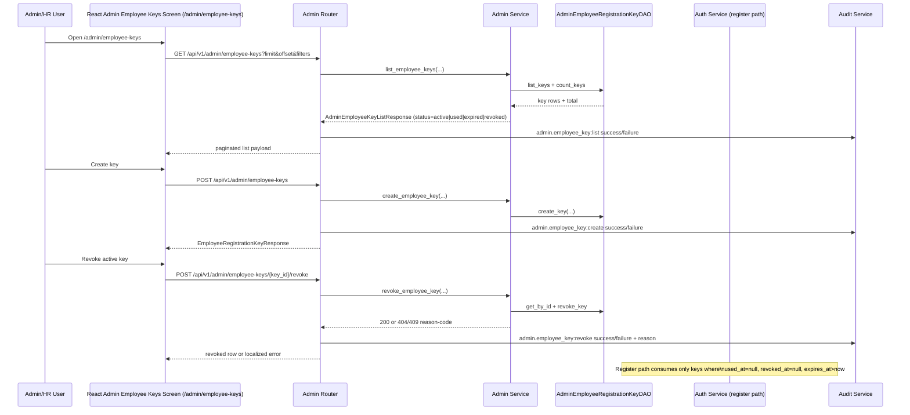
