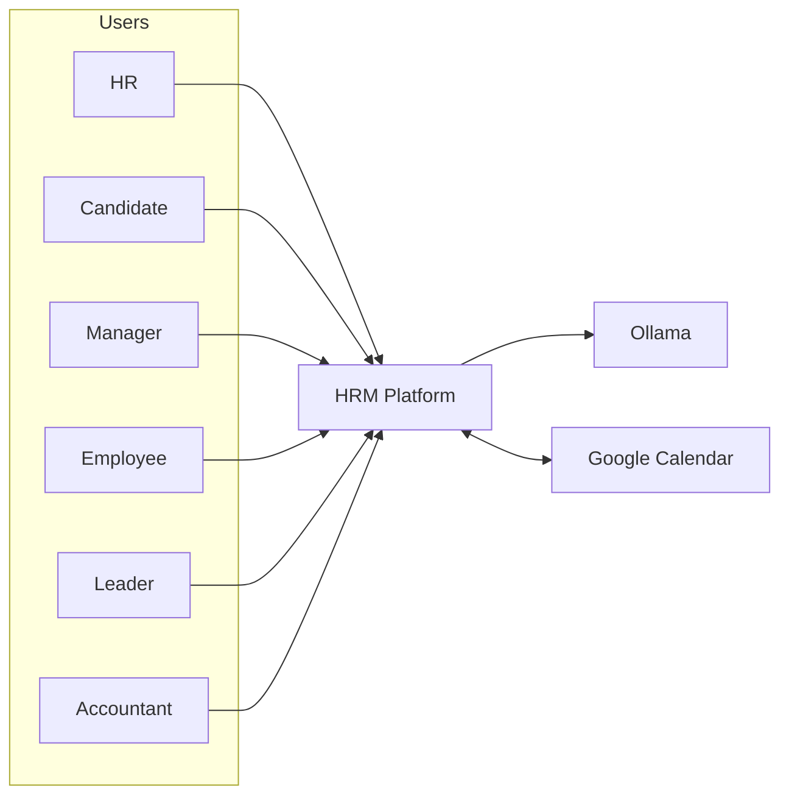
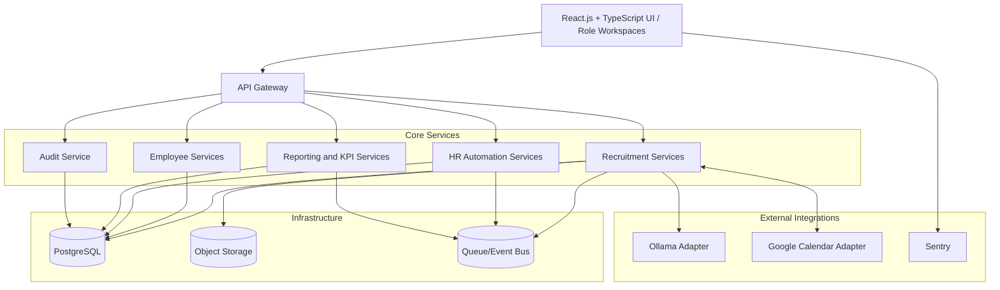
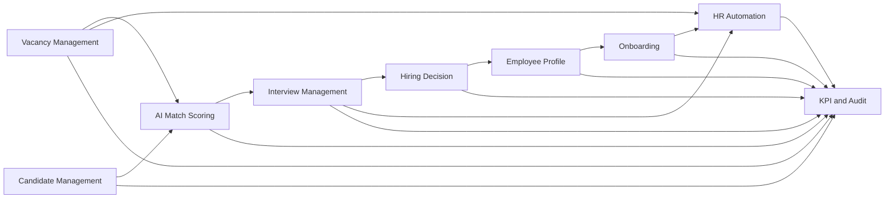
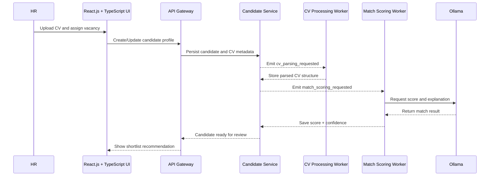
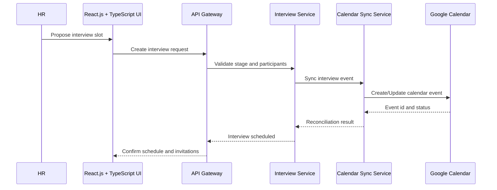
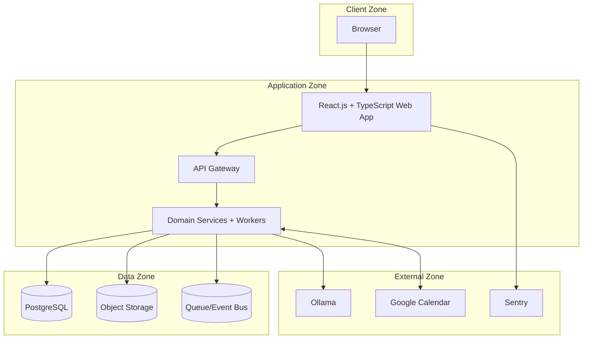
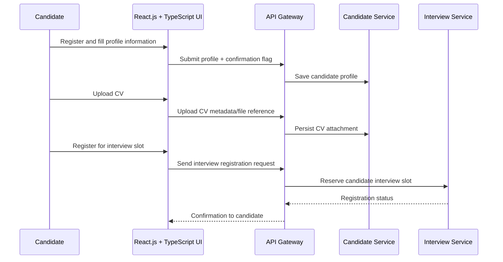
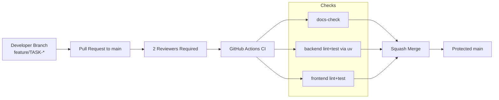

# Architecture Diagrams

## Last Updated
- Date: 2026-03-04
- Updated by: architect

This file is the canonical diagram set for the system. Update diagrams whenever architecture, data flow, or critical business flow changes.

## Diagram 1: System Context (C4-L1)

## Diagram 2: Container View (C4-L2)

## Diagram 3: Domain Interaction

## Diagram 4: Candidate Screening Sequence

## Diagram 5: Interview Scheduling Sequence

## Diagram 6: Deployment and Trust Boundaries

## Diagram 7: Candidate Self-Service Sequence (v1)

## Diagram 8: Delivery Pipeline (GitHub + CI)

