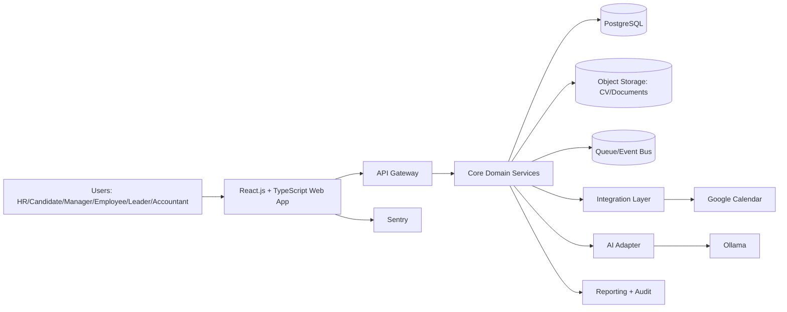

# Architecture Overview

## Last Updated
- Date: 2026-03-12
- Updated by: architect + backend-engineer + frontend-engineer

## System Context
HRM platform for Belarus and Russia that supports candidate selection across professions and
industries, fair interview workflows, onboarding, HR automation, and operational workflows for HR,
managers, employees, leaders, and accountants.

Canonical diagram set: `docs/architecture/diagrams.md`.

## Architecture Principles
- Keep one source of truth for each entity.
- Use modular boundaries and explicit contracts between domains.
- Protect personal data by default.
- Keep synchronous flows minimal and move heavy work to asynchronous jobs.
- Design for phased delivery without rework.
- Keep frontend implementation standardized on React.js + TypeScript.

## Logical Components
| Component | Responsibility | Input | Output | Owner |
| --- | --- | --- | --- | --- |
| React.js + TypeScript Web App | Role-based UX for all user groups, localization (ru/en), candidate self-service | User actions | API requests, UI states | frontend |
| Frontend Telemetry | Client-side route tags, HTTP/render failure capture, release markers, and browser tracing | Browser navigation, frontend errors, request failures | Sentry issues, traces, and tagged events | frontend |
| API Gateway | AuthN/AuthZ entrypoint and request routing | HTTPS requests | Routed calls, access decisions | platform |
| Core Shared Package | Cross-domain backend primitives (`Base`, env utils, HTTP errors, time helpers) | Domain package imports | Reusable technical foundation | platform |
| Auth and Access Service | JWT token lifecycle (PyJWT), Redis denylist checks, role claim propagation | Auth requests and bearer tokens | Auth claims, denylist decisions | platform |
| Admin Governance Domain | Admin-only staff and registration-key governance flows | Admin API requests + auth context | Staff list/update decisions, key lifecycle (issue/list/revoke), audit hooks | platform |
| Recruitment Domain | Vacancies, candidates, pipeline, interviews, schedule-versioned interviewer feedback, offer lifecycle state, and hire-conversion command flow | Candidate and vacancy data | Vacancy/pipeline state, interview fairness state, offer status, active-document readiness, candidate context | hr-tech |
| Match Scoring Domain | Async scoring jobs and explainable score artifacts keyed by vacancy, candidate, and active document | Scoring requests, parsed CV analysis, vacancy snapshot | UI-ready score/status payloads for shortlist review | ai-platform |
| Employee Domain | Durable hire-conversion handoff, explicit employee profile bootstrap, onboarding workflows, employee self-service onboarding portal, and HR/manager onboarding progress visibility | Hire conversion handoff, profile/bootstrap/template/portal/dashboard requests | Employee handoff rows, employee profiles, onboarding runs/templates/tasks, employee-facing onboarding views, and staff/manager onboarding progress read models | hr-tech |
| HR Operations Domain | HR process automation and workflow execution | Rules and triggers | Automated tasks, status updates | hr-ops |
| Finance Domain Adapter | Accounting-facing data exchange | Payroll/accounting requests | Exported records and statuses | finance-tech |
| AI Adapter | External model integration for CV analysis and match scoring | CV files, vacancy profiles, scoring prompts | Structured candidate insights and score responses | ai-platform |
| Integration Layer | External connector abstraction | Internal events/commands | Google Calendar actions | platform |
| Reporting and Audit | KPI tracking and compliance evidence | Domain events | Dashboards, audit logs | data-platform |

## Key Flows
1. Candidate Screening Flow:
   candidate profile + CV -> native PDF/DOCX text extraction -> RU/EN normalization + universal
   workplace/education/title/date/skills enrichment + evidence extraction ->
   recruiter selects vacancy + candidate in `/` -> explicit scoring request ->
   `409` if parsed CV analysis is not ready, otherwise async scoring via Ollama
   (external host by default; compose-local only when `ai-local` profile is enabled explicitly) ->
   persisted score artifact -> recruiter review -> shortlist.
2. Interview Scheduling Flow:
   recruiter selects vacancy + candidate in `/` -> interview create/reschedule ->
   async Google Calendar sync for staff calendars -> sync success issues a public invitation token ->
   HR shares `candidate_invite_url` manually -> candidate opens `/candidate?interviewToken=...` ->
   confirm / request reschedule / decline -> assigned interviewer submits structured feedback on `/` after the interview window closes ->
   `POST /api/v1/pipeline/transitions` applies current-version completeness gate before `interview -> offer`.
3. Offer Workflow:
   after successful `interview -> offer`, the recruitment domain persists one offer row for the current
   vacancy/candidate pair -> HR updates draft terms on the existing vacancy route tree ->
   HR marks the offer as `sent`, then records `accepted` or `declined` manually in `/` ->
   `POST /api/v1/pipeline/transitions` allows `offer -> hired` only after `accepted`; on success the
   same request appends the `hired` transition and persists one durable `hire_conversion` handoff for
   the employee domain, while `offer -> rejected` still requires `declined`.
4. Onboarding Flow:
   durable `hire_conversion` handoff -> staff `POST /api/v1/employees` bootstrap ->
   resolve active checklist baseline on `/api/v1/onboarding/templates` ->
   atomic `employee_profiles + onboarding_runs(status=started) + onboarding_tasks(status=pending)` persistence ->
   HR/admin read, patch, or backfill tasks on `/api/v1/onboarding/runs/{onboarding_id}/tasks` ->
   authenticated employee opens `/employee` -> `/api/v1/employees/me/onboarding` resolves a linked employee profile
   (or lazily reconciles by exact e-mail on first access) ->
   employee updates self-actionable task status on `/api/v1/employees/me/onboarding/tasks/{task_id}` ->
   completion tracking ->
   HR/admin open `/` for an embedded onboarding progress panel or manager opens `/` for a standalone dashboard ->
   `GET /api/v1/onboarding/runs` + `GET /api/v1/onboarding/runs/{onboarding_id}` return summary/detail views,
   while manager visibility stays limited to runs with manager-assigned tasks.
5. HR Automation Flow:
   rule trigger -> workflow engine -> task creation/assignment -> status update and reporting.
6. Public Candidate Apply Flow:
   anonymous vacancy application -> candidate upsert + CV upload -> pipeline transition to `applied` -> async parsing enqueue -> native PDF/DOCX extraction + persisted analysis artifacts -> browser stores `{vacancyId, candidateId, parsingJobId}` -> public tracking/analysis polling by `parsing_job_id`.
7. Authentication Flow:
   staff key issuance -> staff register/login (login/email + password) -> access/refresh JWT issuance -> bearer validation + denylist checks -> refresh rotation -> logout revoke.
8. Admin Staff Governance Flow:
   admin opens `/admin/staff` -> paginated/filterable staff list -> patch `role`/`is_active` ->
   strict guard (self-protection + last-active-admin protection) -> audit success/failure reason codes.
9. Admin Employee Key Lifecycle Flow:
   admin/hr issues key -> list/filter key registry -> revoke active key when needed ->
   registration rejects revoked/expired/used keys -> audit success/failure reason codes.
10. Frontend Observability Flow:
   user opens a critical frontend route -> Sentry tags `workspace`/`role`/`route` are emitted ->
   shared HTTP client captures request failures with route metadata -> top-level render boundary
   captures React render failures -> Sentry stores tagged events with environment/release/tracing context.

## Data Boundaries
- Source of truth entities:
  vacancies, candidates, CV metadata, interview records, employee profiles, onboarding runs/templates/tasks, HR operations, audit events.
- CV analysis artifacts:
  `parsed_profile_json`, `evidence_json`, `detected_language`, `parsed_at` stored per active
  candidate document; `parsed_profile_json` now contains profession-agnostic workplace history with
  employer plus held position, education entries, normalized titles, normalized dates/ranges, and
  generic skills; evidence offsets anchor to extracted text and PDF evidence now carries page
  numbers when extraction can resolve them.
- Match scoring artifacts:
  `match_scoring_jobs` (`queued`, `running`, `succeeded`, `failed`) and score payloads keyed by
  `vacancy_id + candidate_id + active_document_id`, including `score`, `confidence`, `summary`,
  `matched_requirements`, `missing_requirements`, `evidence`, `model_name`, `model_version`, and `scored_at`.
- Interview feedback artifacts:
  `interview_feedback` rows keyed by `interview_id + schedule_version + interviewer_staff_id`,
  including rubric scores, recommendation, qualitative notes, and submission timestamps used by the fairness gate.
- Offer lifecycle artifacts:
  `offers` rows keyed by `vacancy_id + candidate_id`, including `status`, draft terms, send metadata,
  and decision metadata used to gate `offer -> hired/rejected`.
- Hire conversion artifacts:
  `hire_conversions` rows keyed by `vacancy_id + candidate_id`, including `offer_id`,
  `hired_transition_id`, frozen candidate and accepted-offer snapshots, `status`, `converted_at`,
  and `converted_by_staff_id` for downstream employee bootstrap.
- Employee profile artifacts:
  `employee_profiles` rows keyed by `hire_conversion_id`, including source `vacancy_id +
  candidate_id`, frozen core identity fields, candidate `extra_data`, accepted-offer terms summary,
  `start_date`, optional `staff_account_id` identity link for employee self-service, and
  `created_by_staff_id`.
- Onboarding-start artifacts:
  `onboarding_runs` rows keyed by `employee_id`, including copied `hire_conversion_id`,
  `status=started`, `started_at`, and `started_by_staff_id` as the durable input for later
  checklist/task slices.
- Onboarding template artifacts:
  `onboarding_templates` rows keyed by `template_id` plus `onboarding_template_items` child rows,
  including unique template name, `is_active` default selection flag, stable item codes,
  titles/descriptions, sort order, and `is_required` markers for later task generation.
- Onboarding task artifacts:
  `onboarding_tasks` rows keyed by `task_id`, including owning `onboarding_id`, copied
  `template_id + template_item_id` provenance, frozen task snapshot fields (`code`, `title`,
  `description`, `sort_order`, `is_required`), workflow `status`, optional assignment metadata
  (`assigned_role`, `assigned_staff_id`), optional `due_at`, server-managed `completed_at`, and
  the employee-facing completion state read from `/api/v1/employees/me/onboarding`; HR/admin and
  managers consume the same durable task rows through `/api/v1/onboarding/runs*` without a
  separate reporting table in this slice.
- Auth revocation artifacts:
  denylisted token ids (`jti`) and session ids (`sid`) in Redis.
- External integrations: Ollama, Google Calendar
- Sensitive data classes:
  candidate and employee personal data, interview evaluations, HR records, accounting exports.

## Deployment View
- Runtime style: modular monolith first, with clear domain modules and async workers.
- Shared backend primitives are centralized in `hrm_backend/core` to prevent domain duplication.
- Package boundary baseline:
  `hrm_backend/auth` handles auth/session lifecycle; `hrm_backend/admin` handles admin governance APIs.
- Implemented package boundary:
  `hrm_backend/scoring` handles scoring jobs, score artifacts, Ollama integration, and scoring API contracts without mixing this logic into `candidates` or `vacancies`.
- Implemented employee boundary:
  `hrm_backend/employee` now owns durable `hire_conversions` handoff records created on the existing
  `offer -> hired` transition plus staff-facing `employee_profiles` bootstrap APIs on
  `/api/v1/employees`; successful bootstrap now atomically persists one `onboarding_runs`
  artifact plus materialized `onboarding_tasks`, staff-facing template management lives on
  `/api/v1/onboarding/templates`, staff task operations/backfill live on
  `/api/v1/onboarding/runs/{onboarding_id}/tasks`, and employee self-service onboarding reads and
  task status updates live on `/api/v1/employees/me/onboarding*` with a durable
  `employee_profiles.staff_account_id` identity link; read-only onboarding progress list/detail
  routes now live on `/api/v1/onboarding/runs*`, where HR/admin see all runs and managers see only
  manager-scoped assignments.
- Environment baseline: Docker + Docker Compose for deterministic local/dev and CI-aligned stack startup.
- Compose baseline services: `frontend`, `backend`, `backend-worker`, `postgres`, `postgres-init`, `backend-migrate`, `redis`, `minio`, `minio-init`.
- Compose bootstrap baseline: `postgres-init`, `backend-migrate`, and `minio-init` are one-shot prerequisites before steady-state services are considered ready.
- Compose scoring default remains external-host compatible:
  `OLLAMA_BASE_URL=http://host.docker.internal:11434`.
- Linux-safe external-host scoring baseline:
  `backend` and `backend-worker` inject `host.docker.internal:host-gateway`.
- Optional compose-local AI runtime:
  `OLLAMA_BASE_URL=http://ollama:11434 docker compose --profile ai-local up -d --build`
  adds `ollama`, `ollama-init`, and persistent `ollama_data` without changing the default startup path.
- Compose smoke baseline remains unchanged:
  `./scripts/smoke-compose.sh` still validates login + public apply only, while real scoring verification lives in opt-in `./scripts/smoke-scoring-compose.sh`.
- Async runtime baseline: dedicated `backend-worker` (Celery) processing DB-backed jobs on
  `cv_parsing`, `match_scoring`, and `interview_sync` queues.
- Frontend style: React.js + TypeScript SPA with role-based route guards and shared component system.
- Frontend libraries: MUI, React Router, TanStack Query, React Hook Form, Zod, i18next.
- Browser support target: Google Chrome.
- Monitoring: Sentry.
- Frontend telemetry config baseline:
  `VITE_SENTRY_DSN`, `VITE_SENTRY_ENVIRONMENT`, `VITE_SENTRY_RELEASE`,
  `VITE_SENTRY_TRACES_SAMPLE_RATE`.
- Mobile app: out of scope, responsive web only.
- Storage:
  PostgreSQL for transactional data, object storage for CV/documents, queue for async jobs.
- Integration style:
  internal command/event interfaces + connector adapters for external systems.
- Auth config baseline:
  `HRM_JWT_SECRET`, `HRM_JWT_ALGORITHM`, `HRM_ACCESS_TOKEN_TTL_SECONDS`, `HRM_REFRESH_TOKEN_TTL_SECONDS`, `HRM_AUTH_REDIS_PREFIX`, `REDIS_URL`.
- Staff auth additions:
  `EMPLOYEE_KEY_TTL_SECONDS` and Celery runtime settings (`CELERY_BROKER_URL`, `CELERY_RESULT_BACKEND`, `CELERY_TASK_DEFAULT_QUEUE`, `CELERY_TASK_TIME_LIMIT_SECONDS`).
- Scoring runtime additions:
  `MATCH_SCORING_MAX_ATTEMPTS`, `MATCH_SCORING_MODEL_NAME`,
  `MATCH_SCORING_REQUEST_TIMEOUT_SECONDS`, and `MATCH_SCORING_QUEUE_NAME`.

## Non-Functional Requirements
- Reliability:
  idempotent background jobs, retry policy, failure isolation by domain queue.
- Performance:
  async processing for CV parsing/scoring and reporting-heavy operations.
- Security:
  personal data protection aligned with Belarus/Russia data storage standards, strict role-based access control, immutable audit trail.
- Observability:
  structured logs, metrics by domain, trace IDs across API and async jobs; Sentry for frontend
  route tags, HTTP/render failure capture, release markers, and browser traces.

## Known Technical Risks
- Scope risk from broad v1 expectation.
- AI output quality variance across candidate domains and CV formats.
- Interview workflow is implemented from `docs/project/interview-planning-pass.md`, but runtime still carries calendar-integration and manual-invite delivery risk because the free Google Calendar mode depends on manually shared interviewer calendars.
- Offer workflow currently records candidate decisions through staff actions on `/`; candidate-facing offer acceptance/decline transport is intentionally out of scope for this slice.
- Hire conversion handoff, employee bootstrap, onboarding-start persistence, checklist template
  management, onboarding task generation, employee self-service portal, and the first
  HR/manager onboarding progress dashboard are now implemented, but broader manager/team hiring
  visibility remains deferred to `TASK-09-01`.
- First-time employee self-service access currently relies on exact e-mail reconciliation when
  `employee_profiles.staff_account_id` is still null; ambiguous duplicate e-mail data fails closed
  with an identity-conflict error until HR cleans the source records.
- Integration instability risk with calendar sync edge cases.
- Optional compose-local Ollama verification now removes the external-host dependency for real scoring checks, but first-run bootstrap can be slower because the model pull is explicit and persistent-volume backed.
- Compliance risk if country-specific legal acts are not mapped early.

## Delivery Phases
1. Phase 1 baseline:
   admin control plane, public candidate intake/tracking, HR vacancy/pipeline workspace, and browser smoke.
2. Phase 1 scoring slice:
   dedicated scoring backend package + async scoring lifecycle + shortlist review in the existing HR workspace.
3. Phase 1 interview scheduling slice:
   implemented from the planning baseline in `docs/project/interview-planning-pass.md` without changing candidate auth or route topology; Google Calendar sync uses a service-account key plus manually shared interviewer calendars, while candidate delivery remains a manual invite-link flow.
4. Phase 2:
   Manager/Employee/Accountant/Leader capabilities, expanded automation and reporting.
