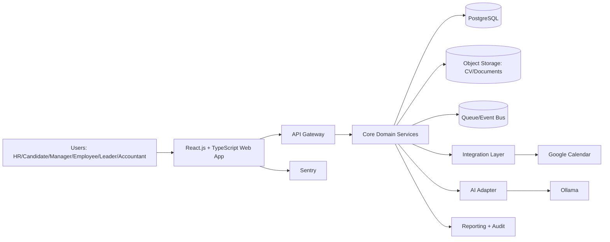

# Architecture Overview

## Last Updated
- Date: 2026-03-04
- Updated by: architect

## System Context
HRM platform for Belarus and Russia that supports candidate selection, fair interview workflows, onboarding, HR automation, and operational workflows for HR, managers, employees, leaders, and accountants.

Canonical diagram set: `docs/architecture/diagrams.md`.

## Architecture Principles
- Keep one source of truth for each entity.
- Use modular boundaries and explicit contracts between domains.
- Protect personal data by default.
- Keep synchronous flows minimal and move heavy work to asynchronous jobs.
- Design for phased delivery without rework.
- Keep frontend implementation standardized on React.js + TypeScript.

## Logical Components
| Component | Responsibility | Input | Output | Owner |
| --- | --- | --- | --- | --- |
| React.js + TypeScript Web App | Role-based UX for all user groups, localization (ru/en), candidate self-service | User actions | API requests, UI states | frontend |
| Frontend Telemetry | Client-side errors and performance telemetry | Browser events/errors | Sentry issues and traces | frontend |
| API Gateway | AuthN/AuthZ entrypoint and request routing | HTTPS requests | Routed calls, access decisions | platform |
| Recruitment Domain | Vacancies, candidates, pipeline, interview lifecycle | Candidate and vacancy data | Match scores, pipeline states | hr-tech |
| Employee Domain | Employee profile and onboarding workflows | Hire decisions, profile data | Employee records, onboarding tasks | hr-tech |
| HR Operations Domain | HR process automation and workflow execution | Rules and triggers | Automated tasks, status updates | hr-ops |
| Finance Domain Adapter | Accounting-facing data exchange | Payroll/accounting requests | Exported records and statuses | finance-tech |
| AI Adapter | CV analysis and recommendation orchestration | CV files, vacancy profiles | Structured candidate insights | ai-platform |
| Integration Layer | External connector abstraction | Internal events/commands | Google Calendar actions | platform |
| Reporting and Audit | KPI tracking and compliance evidence | Domain events | Dashboards, audit logs | data-platform |

## Key Flows
1. Candidate Screening Flow:
   candidate profile + CV -> CV parsing -> AI scoring via Ollama -> recruiter review -> shortlist.
2. Interview Scheduling Flow:
   pipeline stage change -> interview request -> Google Calendar sync -> participant notifications.
3. Onboarding Flow:
   accepted candidate -> employee profile creation -> onboarding checklist -> completion tracking.
4. HR Automation Flow:
   rule trigger -> workflow engine -> task creation/assignment -> status update and reporting.
5. Candidate Self-Service Flow:
   candidate registration -> profile confirmation -> CV upload -> interview registration.

## Data Boundaries
- Source of truth entities:
  vacancies, candidates, CV metadata, interview records, employee profiles, onboarding tasks, HR operations, audit events.
- External integrations: Ollama, Google Calendar
- Sensitive data classes:
  candidate and employee personal data, interview evaluations, HR records, accounting exports.

## Deployment View
- Runtime style: modular monolith first, with clear domain modules and async workers.
- Frontend style: React.js + TypeScript SPA with role-based route guards and shared component system.
- Frontend libraries: MUI, React Router, TanStack Query, React Hook Form, Zod, i18next.
- Browser support target: Google Chrome.
- Monitoring: Sentry.
- Mobile app: out of scope, responsive web only.
- Storage:
  PostgreSQL for transactional data, object storage for CV/documents, queue for async jobs.
- Integration style:
  internal command/event interfaces + connector adapters for external systems.

## Non-Functional Requirements
- Reliability:
  idempotent background jobs, retry policy, failure isolation by domain queue.
- Performance:
  async processing for CV parsing/scoring and reporting-heavy operations.
- Security:
  personal data protection aligned with Belarus/Russia data storage standards, strict role-based access control, immutable audit trail.
- Observability:
  structured logs, metrics by domain, trace IDs across API and async jobs; Sentry for frontend telemetry.

## Known Technical Risks
- Scope risk from broad v1 expectation.
- AI output quality variance across candidate domains and CV formats.
- Integration instability risk with calendar sync edge cases.
- Compliance risk if country-specific legal acts are not mapped early.

## Delivery Phases
1. Phase 1 (priority):
   HR + Candidate capabilities, recruitment pipeline, CV analysis, interview scheduling.
2. Phase 2:
   Manager/Employee/Accountant/Leader capabilities, expanded automation and reporting.
