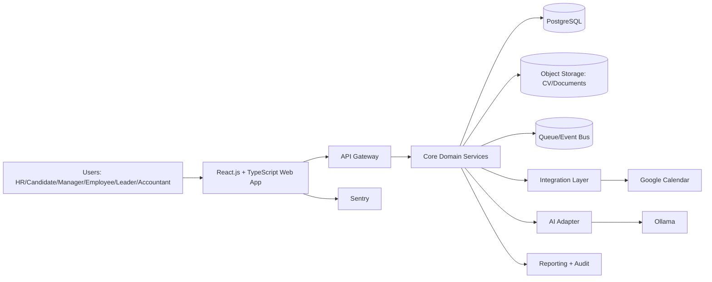

# Architecture Overview

## Last Updated
- Date: 2026-03-10
- Updated by: architect + devops-engineer

## System Context
HRM platform for Belarus and Russia that supports candidate selection, fair interview workflows, onboarding, HR automation, and operational workflows for HR, managers, employees, leaders, and accountants.

Canonical diagram set: `docs/architecture/diagrams.md`.

## Architecture Principles
- Keep one source of truth for each entity.
- Use modular boundaries and explicit contracts between domains.
- Protect personal data by default.
- Keep synchronous flows minimal and move heavy work to asynchronous jobs.
- Design for phased delivery without rework.
- Keep frontend implementation standardized on React.js + TypeScript.

## Logical Components
| Component | Responsibility | Input | Output | Owner |
| --- | --- | --- | --- | --- |
| React.js + TypeScript Web App | Role-based UX for all user groups, localization (ru/en), candidate self-service | User actions | API requests, UI states | frontend |
| Frontend Telemetry | Client-side route tags, HTTP/render failure capture, release markers, and browser tracing | Browser navigation, frontend errors, request failures | Sentry issues, traces, and tagged events | frontend |
| API Gateway | AuthN/AuthZ entrypoint and request routing | HTTPS requests | Routed calls, access decisions | platform |
| Core Shared Package | Cross-domain backend primitives (`Base`, env utils, HTTP errors, time helpers) | Domain package imports | Reusable technical foundation | platform |
| Auth and Access Service | JWT token lifecycle (PyJWT), Redis denylist checks, role claim propagation | Auth requests and bearer tokens | Auth claims, denylist decisions | platform |
| Admin Governance Domain | Admin-only staff and registration-key governance flows | Admin API requests + auth context | Staff list/update decisions, key lifecycle (issue/list/revoke), audit hooks | platform |
| Recruitment Domain | Vacancies, candidates, pipeline, active CV document state | Candidate and vacancy data | Vacancy/pipeline state, active-document readiness, candidate context | hr-tech |
| Match Scoring Domain | Async scoring jobs and explainable score artifacts keyed by vacancy, candidate, and active document | Scoring requests, parsed CV analysis, vacancy snapshot | UI-ready score/status payloads for shortlist review | ai-platform |
| Employee Domain | Employee profile and onboarding workflows | Hire decisions, profile data | Employee records, onboarding tasks | hr-tech |
| HR Operations Domain | HR process automation and workflow execution | Rules and triggers | Automated tasks, status updates | hr-ops |
| Finance Domain Adapter | Accounting-facing data exchange | Payroll/accounting requests | Exported records and statuses | finance-tech |
| AI Adapter | External model integration for CV analysis and match scoring | CV files, vacancy profiles, scoring prompts | Structured candidate insights and score responses | ai-platform |
| Integration Layer | External connector abstraction | Internal events/commands | Google Calendar actions | platform |
| Reporting and Audit | KPI tracking and compliance evidence | Domain events | Dashboards, audit logs | data-platform |

## Key Flows
1. Candidate Screening Flow:
   candidate profile + CV -> CV parsing -> RU/EN normalization + evidence extraction ->
   recruiter selects vacancy + candidate in `/` -> explicit scoring request ->
   `409` if parsed CV analysis is not ready, otherwise async scoring via Ollama ->
   persisted score artifact -> recruiter review -> shortlist.
2. Interview Scheduling Flow:
   recruiter selects vacancy + candidate in `/` -> interview create/reschedule ->
   async Google Calendar sync for staff calendars -> sync success issues a public invitation token ->
   HR shares `candidate_invite_url` manually -> candidate opens `/candidate?interviewToken=...` ->
   confirm / request reschedule / decline -> HR resolves follow-up actions.
3. Onboarding Flow:
   accepted candidate -> employee profile creation -> onboarding checklist -> completion tracking.
4. HR Automation Flow:
   rule trigger -> workflow engine -> task creation/assignment -> status update and reporting.
5. Public Candidate Apply Flow:
   anonymous vacancy application -> candidate upsert + CV upload -> pipeline transition to `applied` -> async parsing enqueue -> browser stores `{vacancyId, candidateId, parsingJobId}` -> public tracking/analysis polling by `parsing_job_id`.
6. Authentication Flow:
   staff key issuance -> staff register/login (login/email + password) -> access/refresh JWT issuance -> bearer validation + denylist checks -> refresh rotation -> logout revoke.
7. Admin Staff Governance Flow:
   admin opens `/admin/staff` -> paginated/filterable staff list -> patch `role`/`is_active` ->
   strict guard (self-protection + last-active-admin protection) -> audit success/failure reason codes.
8. Admin Employee Key Lifecycle Flow:
   admin/hr issues key -> list/filter key registry -> revoke active key when needed ->
   registration rejects revoked/expired/used keys -> audit success/failure reason codes.
9. Frontend Observability Flow:
   user opens a critical frontend route -> Sentry tags `workspace`/`role`/`route` are emitted ->
   shared HTTP client captures request failures with route metadata -> top-level render boundary
   captures React render failures -> Sentry stores tagged events with environment/release/tracing context.

## Data Boundaries
- Source of truth entities:
  vacancies, candidates, CV metadata, interview records, employee profiles, onboarding tasks, HR operations, audit events.
- CV analysis artifacts:
  `parsed_profile_json`, `evidence_json`, `detected_language`, `parsed_at` stored per active candidate document.
- Match scoring artifacts:
  `match_scoring_jobs` (`queued`, `running`, `succeeded`, `failed`) and score payloads keyed by
  `vacancy_id + candidate_id + active_document_id`, including `score`, `confidence`, `summary`,
  `matched_requirements`, `missing_requirements`, `evidence`, `model_name`, `model_version`, and `scored_at`.
- Auth revocation artifacts:
  denylisted token ids (`jti`) and session ids (`sid`) in Redis.
- External integrations: Ollama, Google Calendar
- Sensitive data classes:
  candidate and employee personal data, interview evaluations, HR records, accounting exports.

## Deployment View
- Runtime style: modular monolith first, with clear domain modules and async workers.
- Shared backend primitives are centralized in `hrm_backend/core` to prevent domain duplication.
- Package boundary baseline:
  `hrm_backend/auth` handles auth/session lifecycle; `hrm_backend/admin` handles admin governance APIs.
- Implemented package boundary:
  `hrm_backend/scoring` handles scoring jobs, score artifacts, Ollama integration, and scoring API contracts without mixing this logic into `candidates` or `vacancies`.
- Environment baseline: Docker + Docker Compose for deterministic local/dev and CI-aligned stack startup.
- Compose baseline services: `frontend`, `backend`, `backend-worker`, `postgres`, `postgres-init`, `backend-migrate`, `redis`, `minio`, `minio-init`.
- Compose bootstrap baseline: `postgres-init`, `backend-migrate`, and `minio-init` are one-shot prerequisites before steady-state services are considered ready.
- Async runtime baseline: dedicated `backend-worker` (Celery) processing DB-backed jobs on
  `cv_parsing`, `match_scoring`, and `interview_sync` queues.
- Frontend style: React.js + TypeScript SPA with role-based route guards and shared component system.
- Frontend libraries: MUI, React Router, TanStack Query, React Hook Form, Zod, i18next.
- Browser support target: Google Chrome.
- Monitoring: Sentry.
- Frontend telemetry config baseline:
  `VITE_SENTRY_DSN`, `VITE_SENTRY_ENVIRONMENT`, `VITE_SENTRY_RELEASE`,
  `VITE_SENTRY_TRACES_SAMPLE_RATE`.
- Mobile app: out of scope, responsive web only.
- Storage:
  PostgreSQL for transactional data, object storage for CV/documents, queue for async jobs.
- Integration style:
  internal command/event interfaces + connector adapters for external systems.
- Auth config baseline:
  `HRM_JWT_SECRET`, `HRM_JWT_ALGORITHM`, `HRM_ACCESS_TOKEN_TTL_SECONDS`, `HRM_REFRESH_TOKEN_TTL_SECONDS`, `HRM_AUTH_REDIS_PREFIX`, `REDIS_URL`.
- Staff auth additions:
  `EMPLOYEE_KEY_TTL_SECONDS` and Celery runtime settings (`CELERY_BROKER_URL`, `CELERY_RESULT_BACKEND`, `CELERY_TASK_DEFAULT_QUEUE`, `CELERY_TASK_TIME_LIMIT_SECONDS`).
- Scoring runtime additions:
  `MATCH_SCORING_MAX_ATTEMPTS`, `MATCH_SCORING_MODEL_NAME`,
  `MATCH_SCORING_REQUEST_TIMEOUT_SECONDS`, and `MATCH_SCORING_QUEUE_NAME`.

## Non-Functional Requirements
- Reliability:
  idempotent background jobs, retry policy, failure isolation by domain queue.
- Performance:
  async processing for CV parsing/scoring and reporting-heavy operations.
- Security:
  personal data protection aligned with Belarus/Russia data storage standards, strict role-based access control, immutable audit trail.
- Observability:
  structured logs, metrics by domain, trace IDs across API and async jobs; Sentry for frontend
  route tags, HTTP/render failure capture, release markers, and browser traces.

## Known Technical Risks
- Scope risk from broad v1 expectation.
- AI output quality variance across candidate domains and CV formats.
- Interview workflow is implemented from `docs/project/interview-planning-pass.md`, but runtime still carries calendar-integration and manual-invite delivery risk because the free Google Calendar mode depends on manually shared interviewer calendars.
- Integration instability risk with calendar sync edge cases.
- Compliance risk if country-specific legal acts are not mapped early.

## Delivery Phases
1. Phase 1 baseline:
   admin control plane, public candidate intake/tracking, HR vacancy/pipeline workspace, and browser smoke.
2. Phase 1 scoring slice:
   dedicated scoring backend package + async scoring lifecycle + shortlist review in the existing HR workspace.
3. Phase 1 interview scheduling slice:
   implemented from the planning baseline in `docs/project/interview-planning-pass.md` without changing candidate auth or route topology; Google Calendar sync uses a service-account key plus manually shared interviewer calendars, while candidate delivery remains a manual invite-link flow.
4. Phase 2:
   Manager/Employee/Accountant/Leader capabilities, expanded automation and reporting.
